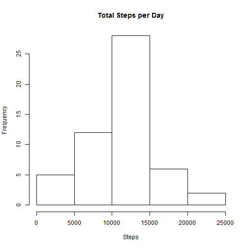
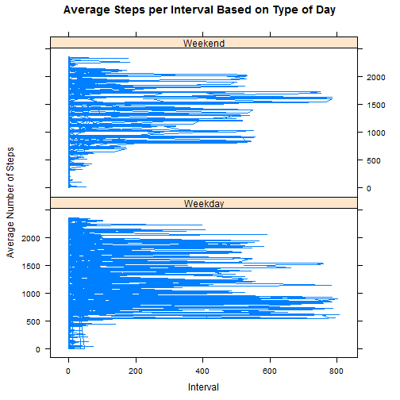

Reproducible Research Assignment One
=====================================

Read in the Activity data set.  

```r
activity <- read.csv(file="activity.csv")
summary(activity)
```

```
##      steps                date          interval     
##  Min.   :  0.00   2012-10-01:  288   Min.   :   0.0  
##  1st Qu.:  0.00   2012-10-02:  288   1st Qu.: 588.8  
##  Median :  0.00   2012-10-03:  288   Median :1177.5  
##  Mean   : 37.38   2012-10-04:  288   Mean   :1177.5  
##  3rd Qu.: 12.00   2012-10-05:  288   3rd Qu.:1766.2  
##  Max.   :806.00   2012-10-06:  288   Max.   :2355.0  
##  NA's   :2304     (Other)   :15840
```
Process the data into a suitable format for analysis.  

```r
activity$day <- weekdays(as.Date(activity$date))
activity$DateTime<- as.POSIXct(activity$date, format="%Y-%m-%d")
totalStepsdays <- aggregate(steps ~ date, activity,  FUN = sum)
clean <- activity[!is.na(activity$steps),]
```

Q1: What is mean total number of steps taken per day?
-----------------------------------------------------
Calculate the total number of steps taken per day.

```r
sumTable <- aggregate(activity$steps ~ activity$date, FUN=sum, )
colnames(sumTable)<- c("Date", "Steps")
```
Create a histogram.

```r
hist(sumTable$Steps, breaks=5, xlab="Steps", main = "Total Steps per Day")
```


Calculate and report the mean and median of the total number of steps taken per day.

```r
as.integer(mean(sumTable$Steps))
```

```
## [1] 10766
```

```r
as.integer(median(sumTable$Steps))
```

```
## [1] 10765
```
The average number of steps taken each day was 10766 steps.  
The median number of steps taken each day was 10765 steps.  

Q2: What is the average daily activity pattern?
------------------------------------------------

Make a time series plot of the 5-minute interval (x-axis) and the average number of steps taken, averaged across all days (y-axis).

```r
library(plyr)
library(ggplot2)
clean <- activity[!is.na(activity$steps),]

intervalTable <- ddply(clean, .(interval), summarize, Avg = mean(steps))

p <- ggplot(intervalTable, aes(x=interval, y=Avg), xlab = "Interval", ylab="Average Number of Steps")
p + geom_line()+xlab("Interval")+ylab("Average Number of Steps")+ggtitle("Average Number of Steps per Interval")
```


Which 5-minute interval, on avergae across all the days in the dataset, contains the maximum number of steps?

```r
maxSteps <- max(intervalTable$Avg)
intervalTable[intervalTable$Avg==maxSteps,1]
```

```
## [1] 835
```
The maximum numbre of steps for a 5-minute interval was 206.
The 5-minute interval which had the maximum number of steps was the 835 interval.

Inputting Missing Values
=========================

Calculate and report the total number of missing values in the dataset (i.e. the total number of rows with NAs).

```r
nrow(activity[is.na(activity$steps),])
```

```
## [1] 2304
```

Devise a strategy for filling in all of the missing values in the dataset. The strategy does not need to be sophisticated. For example, you could use the mean/median for that day, or the mean for that 5-minute interval, etc.


```r
avgTable <- ddply(clean, .(interval, date), summarize, Avg = mean(steps))
nadata <- activity[is.na(activity$steps),]
newdata <- merge(nadata, activity, by="interval", "date")
```

```
## Warning in merge.data.frame(nadata, activity, by = "interval", "date"):
## column name 'date' is duplicated in the result
```
Create a new dataset that is equal to the original dataset but with the missing data filled in.

```r
activity2 <- subset(activity, !is.na(activity$steps))
dAta <- activity
imPact <- is.na(dAta$steps)
tAvg <- tapply(activity2$steps, activity2$interval, mean, na.rm = TRUE, simplify = T)
dAta$steps[imPact] <- tAvg[as.character(dAta$interval[imPact])]
```
Make a histogram of the total number of steps taken each day and Calculate and report the mean and median total number of steps taken per day. Do these values differ from the estimates from the first part of the assignment? What is the impact of imputing missing data on the estimates of the total daily number of steps?


```r
totalStepsperday2 <- aggregate(steps ~ date, dAta, FUN = sum)
par(mar = c(5,8,3,1))

hist(totalStepsperday2$steps, breaks = 10, col = "pink", xlab = "Daily Steps", main = "Total Steps In A Day")
hist(totalStepsdays$steps, breaks = 10, col = "red", xlab = "Daily Steps", main = "Total Steps In A Day", add=T) 
legend("topleft", c("Imputed", "NA"), fill = c("pink","red"))
```

![plot of chunk ]](figure/]-1.png)
Mean and median totals.

```r
mean(totalStepsdays$steps)
```

```
## [1] 10766.19
```

```r
mean(totalStepsperday2$steps)
```

```
## [1] 10766.19
```

```r
median(totalStepsdays$steps)
```

```
## [1] 10765
```

```r
median(totalStepsperday2$steps)
```

```
## [1] 10766.19
```
The mean remains the same, but the median is slightly increased.

Q4: Are there differences in activity patterns between weekday and weekends?
-----------------------------------------------------------------------------

Create a new factor variable in the dataset with two levels – “weekday” and “weekend” indicating whether a given date is a weekday or weekend day.


```r
dAta$DayCategory <- ifelse(dAta$day %in% c("Saturday", "Sunday"), "Weekend", "Weekday")
```
Make a panel plot containing a time series plot (i.e. type = "l") of the 5-minute interval (x-axis) and the average number of steps taken, averaged across all weekday days or weekend days (y-axis). See the README file in the GitHub repository to see an example of what this plot should look like using simulated data.


```r
library(lattice)
intervalTable2 <- ddply(dAta, .(interval, DayCategory), summarize, Avg = mean(steps))
xyplot(interval ~ steps|DayCategory, data=dAta, type="l",  layout = c(1,2),
       main="Average Steps per Interval Based on Type of Day", 
       ylab="Average Number of Steps", xlab="Interval")
```


